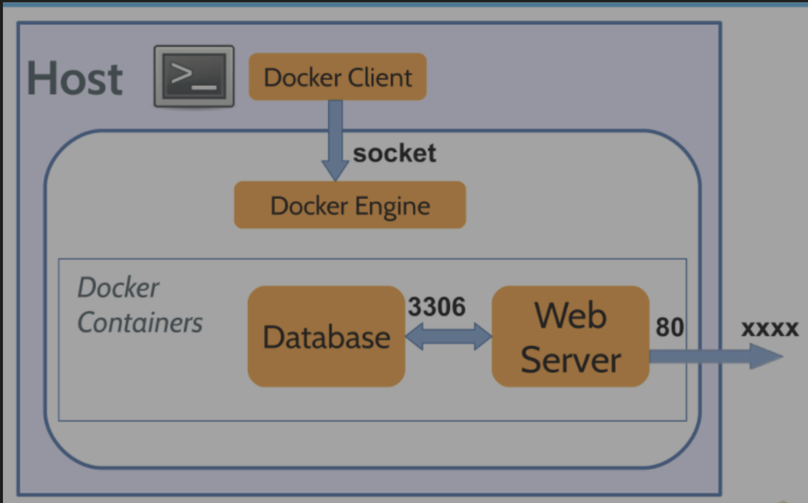

# Core concept of Docker 

## Build, Ship, Run

    Build คือการสร้าง docker image จาก docker file

    Ship คือการนำ docker image ไปเก็บใน docker registry

    Run คือการใช้ docker image ที่อยู่ใน registry มา Run บนเครื่องใดๆ ก็ได้

**ในเหตุการณ์ที่เราย้ายเครื่องใหม่ ก็ไม่ต้องเสียเวลาในการไล่ install package ต่างๆ ก็แค่ pull image มาและ โหลดแค่ IDE

---

## Docker Architecture

docker มี architechture แบบ client & server cli ที่เราพิมพ์คือ client จะไปสั่ง docker engine ให้ทำงานกับ image / container

จากภาพ โลกของ docker จะเป็นโลกของมันเอง => แปลว่า container ที่รันมันมี net work เป็นของตัวเอง, namespace ของมันเอง ไม่สามารถเข้าถึง web server ได้ เนื่องจาก IP ข้างในเป็น IP ของมันเอง

> ดังนั้นทางที่จะสามารถเข้าถึง web server ใน container ได้ มีแค่ทางเดียวคือ การทำ forward port (EXPOSE)ซึ่งแปลว่าถ้าเราเข้าผ่าน port XXXX ที่เรากำหนดนะ มันจะสามารถทะลุเข้าถึง web server port 80 ได้ 

และเช่นกันเราก็ไม่สามารถเข้าถึง database ได้ ถ้าเราไม่ทำการ EXPOSE port ออกมา