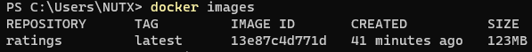
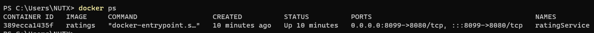
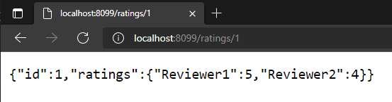

# lab rating 

step

1 create docker file 
-> write instruction
    
2 Build docker file to docker image

    docker build -t {image_name} {docker path}

lab:
    docker build -t ratings .

3 Run docker image to docker container

    docker build -d --name {container_name} -p {externalport: EXPOSE port} {image_name}

lab: 
    docker build -d --name ratingService -p 8099:8080 ratings

result:

